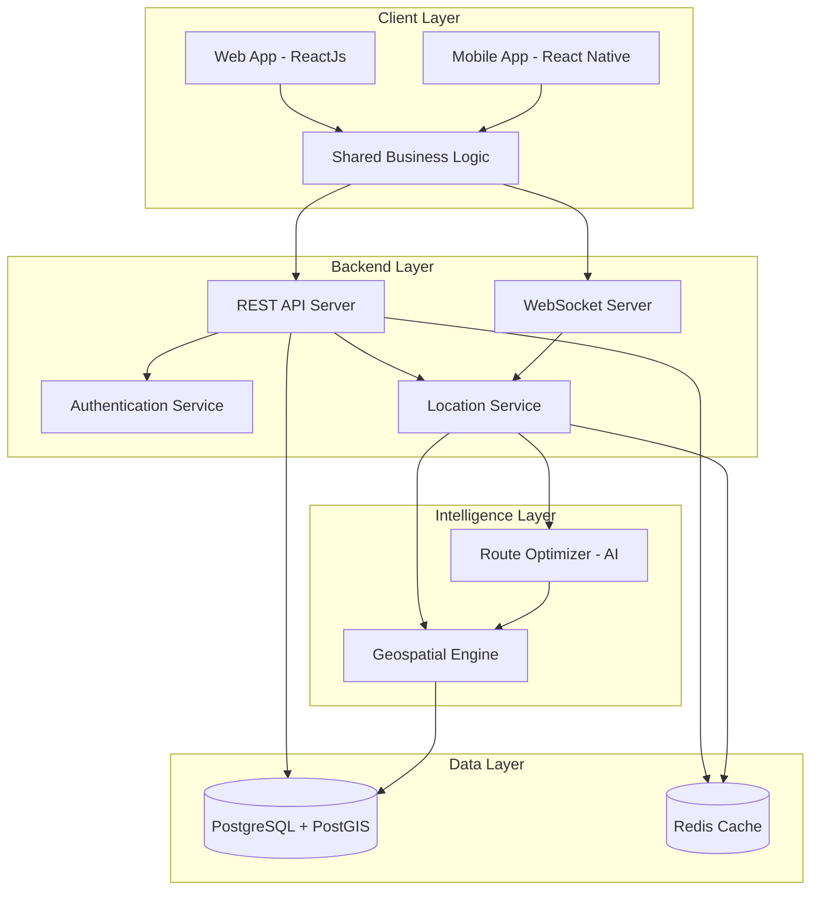

# Design Document: Ferri-Wala

## Overview

Ferri-Wala is a real-time location-based marketplace connecting street hawkers with buyers through an intelligent routing system. The architecture follows a client-server model with real-time bidirectional communication, supporting both web (ReactJs) and mobile (React Native) clients with a shared JavaScript codebase.

The system consists of three primary layers:
1. **Client Layer**: Dual-mode interfaces (Buyer/Hawker) with map visualization and real-time updates
2. **Backend Layer**: RESTful API, WebSocket server, and real-time location processing
3. **Intelligence Layer**: AI-powered route optimization using traveling salesman problem (TSP) algorithms

Key design principles:
- Real-time data synchronization with sub-10-second latency
- Offline-first architecture with request queuing
- Privacy-conscious location sharing with explicit user control
- Cross-platform code reuse between web and mobile (80%+ shared logic)

## Architecture

### System Architecture Diagram



### Technology Stack

**Frontend:**
- Web: ReactJs 18+ with React Router for navigation
- Mobile: React Native 0.72+ with React Navigation
- Shared: JavaScript ES6+, Redux Toolkit for state management
- Maps: Mapbox GL JS (web) / React Native Mapbox (mobile)
- Real-time: Socket.io-client for WebSocket connections

**Backend:**
- Runtime: Node.js 18+ with Express.js
- Real-time: Socket.io for WebSocket management
- Database: PostgreSQL 15+ with PostGIS extension for geospatial queries
- Cache: Redis 7+ for session management and real-time location data
- Authentication: JWT tokens with refresh token rotation

**Intelligence:**
- Route Optimization: Google OR-Tools for TSP solving
- Geospatial: Turf.js for distance calculations and geofencing
- Heuristics: Nearest neighbor with time-window constraints

### Communication Patterns

**REST API** (HTTP/HTTPS):
- User authentication and session management
- Hawker profile and commodity management
- Historical request data retrieval
- Configuration and settings updates

**WebSocket** (Socket.io):
- Real-time location broadcasts (hawker → server → buyers)
- Purchase request notifications (buyer → server → hawker)
- Route updates and recalculations
- Connection status and heartbeat monitoring

## Components and Interfaces

### 1. Client Components

#### 1.1 Mode Selector Component
```javascript
// ModeSelector.js
interface ModeSelector {
  // Props
  currentMode: 'buyer' | 'hawker' | null
  onModeSelect: (mode: 'buyer' | 'hawker') => void
  
  // Methods
  render(): ReactElement
  persistMode(mode: string): void
  loadPersistedMode(): string | null
}
```

**Responsibilities:**
- Display mode selection UI on app launch
- Persist selected mode to AsyncStorage (mobile) or localStorage (web)
- Trigger mode-specific initialization

#### 1.2 Map Interface Component
```javascript
// MapInterface.js
interface MapInterface {
  // Props
  userMode: 'buyer' | 'hawker'
  userLocation: Coordinates
  markers: Array<Marker>
  route: Array<Coordinates> | null
  
  // Methods
  render(): ReactElement
  centerOnUser(): void
  updateMarkers(markers: Array<Marker>): void
  displayRoute(route: Array<Coordinates>): void
  onMarkerTap(markerId: string): void
}

interface Marker {
  id: string
  type: 'hawker' | 'request'
  coordinates: Coordinates
  metadata: HawkerData | RequestData
}

interface Coordinates {
  latitude: number
  longitude: number
}
```

**Responsibilities:**
- Render interactive map with user location
- Display hawker/request markers based on user mode
- Handle marker interactions and info window display
- Render optimized routes for hawkers
- Update map view every 10 seconds with fresh data

#### 1.3 Location Service (Client)
```javascript
// LocationService.js
interface LocationService {
  // Methods
  requestPermissions(): Promise<boolean>
  getCurrentLocation(): Promise<Coordinates>
  startLocationTracking(callback: (coords: Coordinates) => void): void
  stopLocationTracking(): void
  isLocationEnabled(): boolean
}
```

**Responsibilities:**
- Request and manage location permissions
- Provide current GPS coordinates
- Track location changes with configurable intervals
- Handle permission denial gracefully

#### 1.4 Request Manager (Buyer)
```javascript
// RequestManager.js
interface RequestManager {
  // Methods
  createRequest(request: PurchaseRequest): Promise<RequestResult>
  queueOfflineRequest(request: PurchaseRequest): void
  syncOfflineRequests(): Promise<void>
  getActiveRequests(): Array<PurchaseRequest>
}

interface PurchaseRequest {
  hawkerId: string
  commodities: Array<string>
  timeRange: TimeRange
  buyerLocation: Coordinates
  timestamp: number
}

interface TimeRange {
  startTime: string  // ISO 8601 format
  endTime: string    // ISO 8601 format
}

interface RequestResult {
  success: boolean
  requestId: string | null
  error: string | null
}
```

**Responsibilities:**
- Create and submit purchase requests
- Queue requests when offline
- Retry failed requests with exponential backoff
- Validate request data before submission

#### 1.5 Route Display (Hawker)
```javascript
// RouteDisplay.js
interface RouteDisplay {
  // Props
  requests: Array<BuyerRequest>
  currentLocation: Coordinates
  optimizedRoute: Route | null
  
  // Methods
  render(): ReactElement
  requestRouteOptimization(): Promise<void>
  displayRouteSegments(route: Route): void
  showRequestDetails(requestId: string): void
}

interface BuyerRequest {
  id: string
  buyerLocation: Coordinates
  commodities: Array<string>
  timeRange: TimeRange
  expiresAt: number
}

interface Route {
  segments: Array<RouteSegment>
  totalDistance: number  // meters
  totalDuration: number  // seconds
}

interface RouteSegment {
  from: Coordinates
  to: Coordinates
  requestId: string
  distance: number
  duration: number
  arrivalTime: string
}
```

**Responsibilities:**
- Display buyer requests on map
- Trigger route optimization requests
- Render optimized route with waypoints
- Show estimated arrival times for each request

### 2. Backend Components

#### 2.1 REST API Server
```javascript
// API Endpoints
interface APIServer {
  // Authentication
  POST /api/auth/register
  POST /api/auth/login
  POST /api/auth/refresh
  POST /api/auth/logout
  
  // User Profile
  GET /api/users/profile
  PUT /api/users/profile
  PUT /api/users/mode
  
  // Hawker Management
  GET /api/hawkers/:id
  PUT /api/hawkers/:id/commodities
  GET /api/hawkers/nearby?lat=X&lng=Y&radius=Z
  
  // Request Management
  POST /api/requests
  GET /api/requests/:id
  GET /api/requests/history
  DELETE /api/requests/:id
}
```

**Responsibilities:**
- Handle HTTP requests with authentication
- Validate request payloads
- Interact with database for persistent data
- Return JSON responses with appropriate status codes

#### 2.2 WebSocket Server
```javascript
// WebSocket Events
interface WebSocketServer {
  // Connection Management
  on('connection', (socket) => void)
  on('disconnect', (socket) => void)
  on('authenticate', (token) => void)
  
  // Location Broadcasting (Hawker)
  on('hawker:location:update', (location: Coordinates) => void)
  emit('hawker:location:broadcast', (hawkerData: HawkerLocation) => void)
  
  // Request Notifications (Buyer)
  on('buyer:request:create', (request: PurchaseRequest) => void)
  emit('hawker:request:new', (request: BuyerRequest) => void)
  
  // Route Updates (Hawker)
  on('hawker:route:request', (requests: Array<string>) => void)
  emit('hawker:route:update', (route: Route) => void)
}

interface HawkerLocation {
  hawkerId: string
  coordinates: Coordinates
  commodities: Array<string>
  timestamp: number
}
```

**Responsibilities:**
- Manage WebSocket connections with authentication
- Broadcast hawker locations to nearby buyers
- Deliver purchase requests to hawkers in real-time
- Handle connection failures and reconnection logic
- Implement room-based broadcasting for geofenced areas

#### 2.3 Location Service (Backend)
```javascript
// LocationService.js
interface LocationServiceBackend {
  // Methods
  updateHawkerLocation(hawkerId: string, coords: Coordinates): Promise<void>
  getActiveHawkers(center: Coordinates, radius: number): Promise<Array<HawkerLocation>>
  getBuyerRequests(center: Coordinates, radius: number): Promise<Array<BuyerRequest>>
  removeExpiredRequests(): Promise<void>
  calculateDistance(from: Coordinates, to: Coordinates): number
}
```

**Responsibilities:**
- Store hawker locations in Redis with TTL (time-to-live)
- Query nearby hawkers using geospatial Redis commands
- Retrieve active buyer requests within radius
- Clean up expired requests periodically
- Calculate distances using Haversine formula

#### 2.4 Route Optimizer
```javascript
// RouteOptimizer.js
interface RouteOptimizer {
  // Methods
  optimizeRoute(
    startLocation: Coordinates,
    requests: Array<BuyerRequest>,
    currentTime: number
  ): Promise<Route>
  
  calculateTravelTime(from: Coordinates, to: Coordinates): number
  filterExpiredRequests(requests: Array<BuyerRequest>, currentTime: number): Array<BuyerRequest>
  prioritizeByTimeWindow(requests: Array<BuyerRequest>): Array<BuyerRequest>
}
```

**Responsibilities:**
- Solve traveling salesman problem with time windows
- Use nearest neighbor heuristic for initial solution
- Apply 2-opt optimization for route improvement
- Consider request time ranges and expiration
- Return ordered list of waypoints with timing estimates

### 3. Shared Business Logic

#### 3.1 State Management (Redux)
```javascript
// Redux Store Structure
interface AppState {
  auth: {
    user: User | null
    token: string | null
    mode: 'buyer' | 'hawker' | null
  }
  
  location: {
    current: Coordinates | null
    tracking: boolean
    permission: 'granted' | 'denied' | 'pending'
  }
  
  map: {
    hawkers: Array<HawkerLocation>
    requests: Array<BuyerRequest>
    selectedMarker: string | null
  }
  
  route: {
    optimized: Route | null
    loading: boolean
    error: string | null
  }
  
  network: {
    connected: boolean
    latency: number
    queuedRequests: Array<PurchaseRequest>
  }
}

// Actions
interface Actions {
  // Auth
  setUser(user: User): void
  setMode(mode: 'buyer' | 'hawker'): void
  logout(): void
  
  // Location
  updateLocation(coords: Coordinates): void
  setLocationPermission(status: string): void
  
  // Map
  updateHawkers(hawkers: Array<HawkerLocation>): void
  updateRequests(requests: Array<BuyerRequest>): void
  selectMarker(markerId: string): void
  
  // Route
  setRoute(route: Route): void
  clearRoute(): void
  
  // Network
  setConnectionStatus(connected: boolean): void
  queueRequest(request: PurchaseRequest): void
  removeQueuedRequest(requestId: string): void
}
```

**Responsibilities:**
- Centralized state management across components
- Persist critical state to local storage
- Handle state updates from WebSocket events
- Manage offline request queue

## Data Models

### User Model
```javascript
interface User {
  id: string              // UUID
  email: string
  name: string
  phoneNumber: string
  mode: 'buyer' | 'hawker'
  createdAt: string       // ISO 8601
  updatedAt: string       // ISO 8601
}
```

### Hawker Profile Model
```javascript
interface HawkerProfile {
  userId: string          // Foreign key to User
  commodities: Array<string>
  isActive: boolean
  lastLocation: Coordinates | null
  lastSeen: string | null // ISO 8601
}
```

### Purchase Request Model
```javascript
interface PurchaseRequestDB {
  id: string              // UUID
  buyerId: string         // Foreign key to User
  hawkerId: string        // Foreign key to User
  commodities: Array<string>
  buyerLocation: Coordinates
  timeRangeStart: string  // ISO 8601
  timeRangeEnd: string    // ISO 8601
  status: 'pending' | 'expired' | 'cancelled'
  createdAt: string       // ISO 8601
  expiresAt: string       // ISO 8601
}
```

### Location Cache Model (Redis)
```javascript
// Redis Key: hawker:location:{hawkerId}
interface LocationCache {
  hawkerId: string
  latitude: number
  longitude: number
  commodities: Array<string>
  timestamp: number
  ttl: number             // 60 seconds
}

// Redis Key: request:active:{requestId}
interface RequestCache {
  requestId: string
  buyerId: string
  hawkerId: string
  latitude: number
  longitude: number
  commodities: Array<string>
  timeRangeStart: number  // Unix timestamp
  timeRangeEnd: number    // Unix timestamp
  ttl: number             // Until timeRangeEnd
}
```

### Database Schema (PostgreSQL)

```sql
-- Users table
CREATE TABLE users (
  id UUID PRIMARY KEY DEFAULT gen_random_uuid(),
  email VARCHAR(255) UNIQUE NOT NULL,
  name VARCHAR(255) NOT NULL,
  phone_number VARCHAR(20),
  password_hash VARCHAR(255) NOT NULL,
  mode VARCHAR(10) CHECK (mode IN ('buyer', 'hawker')),
  created_at TIMESTAMP DEFAULT NOW(),
  updated_at TIMESTAMP DEFAULT NOW()
);

-- Hawker profiles table
CREATE TABLE hawker_profiles (
  user_id UUID PRIMARY KEY REFERENCES users(id) ON DELETE CASCADE,
  commodities TEXT[] NOT NULL DEFAULT '{}',
  is_active BOOLEAN DEFAULT false,
  last_location GEOGRAPHY(POINT, 4326),
  last_seen TIMESTAMP
);

-- Purchase requests table
CREATE TABLE purchase_requests (
  id UUID PRIMARY KEY DEFAULT gen_random_uuid(),
  buyer_id UUID NOT NULL REFERENCES users(id) ON DELETE CASCADE,
  hawker_id UUID NOT NULL REFERENCES users(id) ON DELETE CASCADE,
  commodities TEXT[] NOT NULL,
  buyer_location GEOGRAPHY(POINT, 4326) NOT NULL,
  time_range_start TIMESTAMP NOT NULL,
  time_range_end TIMESTAMP NOT NULL,
  status VARCHAR(20) CHECK (status IN ('pending', 'expired', 'cancelled')),
  created_at TIMESTAMP DEFAULT NOW(),
  expires_at TIMESTAMP NOT NULL
);

-- Indexes for performance
CREATE INDEX idx_hawker_profiles_location ON hawker_profiles USING GIST(last_location);
CREATE INDEX idx_purchase_requests_location ON purchase_requests USING GIST(buyer_location);
CREATE INDEX idx_purchase_requests_status ON purchase_requests(status);
CREATE INDEX idx_purchase_requests_expires_at ON purchase_requests(expires_at);
```


## Correctness Properties

*A property is a characteristic or behavior that should hold true across all valid executions of a system—essentially, a formal statement about what the system should do. Properties serve as the bridge between human-readable specifications and machine-verifiable correctness guarantees.*

### Property Reflection

After analyzing all acceptance criteria, I identified several areas where properties can be consolidated:

1. **Geospatial filtering** (2.1 and 5.1): Both test 5km radius filtering for different entity types. These can be combined into a single property about geospatial queries.

2. **Marker display** (2.2 and 5.2): Both test that entities have corresponding map markers. These can be combined into one property about marker rendering.

3. **Marker interaction** (2.3 and 5.3): Both test that tapping markers displays details. These can be combined into one property about marker tap behavior.

4. **Mode activation** (1.2 and 1.3): Both test that selecting a mode activates appropriate features. These can be combined into one property about mode switching.

5. **Permission enforcement** (4.4 and 10.1): Both test that permissions are checked before location access. These can be combined into one property about permission requirements.

### Mode Management Properties

**Property 1: Mode selection activates appropriate features**
*For any* user mode selection (buyer or hawker), activating that mode should enable all features specific to that mode and disable features specific to the other mode.
**Validates: Requirements 1.2, 1.3**

**Property 2: Mode persistence across sessions**
*For any* selected mode, closing and reopening the application should restore the same mode without requiring reselection.
**Validates: Requirements 1.4**

**Property 3: Mode switching without restart**
*For any* current mode, switching to a different mode should immediately activate the new mode's features without requiring application restart.
**Validates: Requirements 1.5**

### Geospatial Properties

**Property 4: Radius-based entity filtering**
*For any* user location and set of entities (hawkers or requests), only entities within the specified radius (5 kilometers) should be returned by geospatial queries.
**Validates: Requirements 2.1, 5.1**

**Property 5: Distance calculation consistency**
*For any* two coordinates, calculating the distance between them using the Haversine formula should produce the same result regardless of calculation order (distance(A, B) = distance(B, A)).
**Validates: Requirements 2.1, 5.1**

### Map Visualization Properties

**Property 6: Entity-to-marker correspondence**
*For any* set of entities (hawkers or requests) displayed on the map, there should be exactly one marker for each entity, positioned at the entity's coordinates.
**Validates: Requirements 2.2, 5.2**

**Property 7: Marker interaction displays details**
*For any* marker tapped on the map, the application should display the complete details (commodities, time range, or other metadata) associated with that marker's entity.
**Validates: Requirements 2.3, 5.3**

**Property 8: Expired requests are filtered**
*For any* set of requests, those with time ranges that have expired relative to the current time should not appear on the map.
**Validates: Requirements 5.5**

### Request Management Properties

**Property 9: Request creation requires commodities**
*For any* purchase request submission attempt, if the commodity list is empty, the request should be rejected and not transmitted.
**Validates: Requirements 3.2**

**Property 10: Request includes buyer location**
*For any* successfully submitted purchase request, the request data should contain the buyer's current GPS coordinates.
**Validates: Requirements 3.5**

**Property 11: Offline request queuing**
*For any* purchase request submitted while network connectivity is unavailable, the request should be added to a local queue and transmitted when connectivity is restored.
**Validates: Requirements 3.6**

**Property 12: Request transmission on connectivity**
*For any* queued request, when network connectivity is restored, the request should be transmitted and removed from the queue upon successful delivery.
**Validates: Requirements 3.6**

### Location Broadcasting Properties

**Property 13: Location sharing state visibility**
*For any* active location sharing session, the hawker interface should display a visual indicator confirming that broadcasting is active.
**Validates: Requirements 4.2**

**Property 14: Location sharing deactivation cleanup**
*For any* hawker, activating location sharing and then deactivating it should result in no location broadcasts being sent and the hawker being removed from buyer maps.
**Validates: Requirements 4.3**

**Property 15: Permission-gated location access**
*For any* attempt to access location data or activate location sharing, the system should first verify that location permissions have been granted, and prevent access if permissions are denied.
**Validates: Requirements 4.4, 4.5, 10.1**

**Property 16: Location broadcasting stops on app close**
*For any* user (buyer or hawker), closing the application should immediately stop any active location broadcasting.
**Validates: Requirements 10.2**

**Property 17: Location broadcasting stops on mode switch**
*For any* hawker switching to buyer mode, the location broadcasting should immediately stop and the user should be removed from the hawker map.
**Validates: Requirements 10.3**

### Route Optimization Properties

**Property 18: Route optimizer considers all requests**
*For any* set of visible buyer requests, when route optimization is triggered, the optimizer should analyze every request in the set.
**Validates: Requirements 6.1**

**Property 19: Route respects time windows**
*For any* optimized route, all waypoints should be scheduled to arrive within the corresponding request's time range, or the request should be excluded from the route.
**Validates: Requirements 6.2**

**Property 20: Route prioritizes earlier expirations**
*For any* optimized route containing multiple requests, requests with earlier expiration times should appear before requests with later expiration times in the route sequence.
**Validates: Requirements 6.3**

**Property 21: Route segments include timing estimates**
*For any* calculated route, each segment should include an estimated travel time and arrival time at the destination.
**Validates: Requirements 6.5**

### Cross-Platform Properties

**Property 22: Session persistence across platforms**
*For any* user session and preferences saved on one platform (web or mobile), accessing the application on a different platform should restore the same session and preferences.
**Validates: Requirements 7.4**

### Visual Design Properties

**Property 23: Color palette compliance**
*For any* UI component rendered in the application, all colors used should be from the approved palette: #c4b8d4, #c9def2, #c5d4d0, #dbd0d6.
**Validates: Requirements 8.1**

**Property 24: Distinct marker colors**
*For any* map view, buyer markers, hawker markers, and route lines should each use different colors from the approved palette to ensure visual distinction.
**Validates: Requirements 8.2**

**Property 25: Color contrast accessibility**
*For any* text element displayed in the application, the contrast ratio between text color and background color should meet WCAG AA standards (minimum 4.5:1 for normal text, 3:1 for large text).
**Validates: Requirements 8.4**

### Network and Connectivity Properties

**Property 26: High latency warning**
*For any* network connection where round-trip latency exceeds 30 seconds, the application should display a connectivity warning to the user.
**Validates: Requirements 9.3**

**Property 27: Permission revocation messaging**
*For any* location permission revocation event, the application should display a message explaining which features (location sharing, nearby hawker discovery, request creation) are unavailable without permissions.
**Validates: Requirements 10.5**

## Error Handling

### Client-Side Error Handling

**Network Errors:**
- **Connection Loss**: Queue all outgoing requests (location updates, purchase requests) in local storage with timestamps
- **Timeout**: Retry failed requests with exponential backoff (1s, 2s, 4s, 8s, max 30s)
- **Server Errors (5xx)**: Display user-friendly error message and retry automatically
- **Client Errors (4xx)**: Display specific error message and do not retry (except 429 rate limiting)

**Location Errors:**
- **Permission Denied**: Display modal explaining why location is needed, with link to settings
- **GPS Unavailable**: Fall back to network-based location, display accuracy warning
- **Location Timeout**: Use last known location if available, otherwise prompt user to check GPS settings

**Validation Errors:**
- **Empty Commodity List**: Prevent request submission, highlight required field
- **Invalid Time Range**: Show error if end time is before start time or in the past
- **Invalid Coordinates**: Reject location updates with latitude outside [-90, 90] or longitude outside [-180, 180]

**State Errors:**
- **Mode Mismatch**: If user tries to access hawker features in buyer mode, prompt to switch modes
- **Expired Session**: Automatically refresh JWT token, or redirect to login if refresh fails
- **Corrupted Local Storage**: Clear corrupted data and reinitialize with defaults

### Backend Error Handling

**Database Errors:**
- **Connection Pool Exhausted**: Queue requests and return 503 Service Unavailable
- **Query Timeout**: Log slow query, return 504 Gateway Timeout, investigate performance
- **Constraint Violation**: Return 400 Bad Request with specific validation error
- **Deadlock**: Retry transaction up to 3 times with random jitter

**WebSocket Errors:**
- **Connection Drop**: Client automatically reconnects with exponential backoff
- **Authentication Failure**: Close socket, return 401 Unauthorized, prompt re-login
- **Message Parse Error**: Log error, send error event to client, continue processing other messages
- **Room Join Failure**: Log error, notify client, allow retry

**External Service Errors:**
- **Route Optimization Timeout**: Fall back to simple nearest-neighbor algorithm
- **Geocoding Service Down**: Use cached coordinates, log error for investigation
- **Rate Limiting**: Implement token bucket algorithm, return 429 with Retry-After header

**Data Validation Errors:**
- **Invalid Coordinates**: Reject with 400 Bad Request, log for security monitoring
- **Malformed Request**: Return 400 with detailed validation errors
- **Missing Required Fields**: Return 422 Unprocessable Entity with field-specific errors

### Error Logging and Monitoring

**Client-Side:**
- Log all errors to console in development
- Send critical errors to backend logging service in production
- Include: error type, stack trace, user ID, timestamp, device info, app version

**Backend:**
- Use structured logging (JSON format) with correlation IDs
- Log levels: DEBUG (development only), INFO (normal operations), WARN (recoverable errors), ERROR (failures), FATAL (system down)
- Monitor error rates and alert on anomalies (>5% error rate, >1000ms p95 latency)

## Testing Strategy

### Dual Testing Approach

The Ferri-Wala application requires both unit testing and property-based testing to ensure comprehensive correctness:

**Unit Tests** focus on:
- Specific examples of correct behavior (e.g., "buyer at coordinates X sees hawker at coordinates Y")
- Edge cases (e.g., empty commodity lists, expired time ranges, boundary coordinates)
- Error conditions (e.g., network failures, permission denials, invalid inputs)
- Integration points between components (e.g., Redux actions updating map state)

**Property Tests** focus on:
- Universal properties that hold for all inputs (e.g., "for any coordinates, distance calculation is symmetric")
- Comprehensive input coverage through randomization (e.g., random locations, random request sets)
- Invariants that must be preserved (e.g., "filtered entities are always within radius")
- Round-trip properties (e.g., "mode persistence across sessions")

Together, unit tests catch concrete bugs in specific scenarios, while property tests verify general correctness across the entire input space.

### Property-Based Testing Configuration

**Library Selection:**
- **JavaScript/React**: Use `fast-check` library for property-based testing
- **Integration**: Configure fast-check to run within Jest test framework
- **Minimum Iterations**: Each property test must run at least 100 iterations with randomized inputs

**Test Tagging Convention:**
Each property-based test must include a comment tag referencing the design document property:

```javascript
// Feature: ferri-wala, Property 4: Radius-based entity filtering
test('geospatial queries return only entities within radius', () => {
  fc.assert(
    fc.property(
      fc.record({
        userLat: fc.double(-90, 90),
        userLng: fc.double(-180, 180),
        entities: fc.array(fc.record({
          lat: fc.double(-90, 90),
          lng: fc.double(-180, 180),
          id: fc.uuid()
        }))
      }),
      ({ userLat, userLng, entities }) => {
        const filtered = filterEntitiesWithinRadius(
          { latitude: userLat, longitude: userLng },
          entities,
          5000 // 5km in meters
        );
        
        // All filtered entities must be within 5km
        return filtered.every(entity => {
          const distance = calculateDistance(
            { latitude: userLat, longitude: userLng },
            { latitude: entity.lat, longitude: entity.lng }
          );
          return distance <= 5000;
        });
      }
    ),
    { numRuns: 100 }
  );
});
```

**Property Test Coverage:**
- Each of the 27 correctness properties must have exactly one corresponding property-based test
- Property tests should be placed in the same test file as the component/function they test
- Run property tests on every commit in CI/CD pipeline

### Unit Testing Strategy

**Component Testing (React):**
- Use React Testing Library for component tests
- Test user interactions (button clicks, form submissions, marker taps)
- Test conditional rendering based on props and state
- Mock external dependencies (API calls, WebSocket connections, location services)

**Integration Testing:**
- Test Redux action creators and reducers together
- Test WebSocket event handlers with mock socket connections
- Test API endpoints with supertest and mock database
- Test route optimization with known input/output pairs

**End-to-End Testing:**
- Use Playwright for web E2E tests
- Use Detox for React Native E2E tests
- Test critical user flows: mode selection, hawker discovery, request creation, route optimization
- Run E2E tests nightly and before releases

### Test Coverage Goals

- **Unit Test Coverage**: Minimum 80% line coverage for business logic
- **Property Test Coverage**: 100% of correctness properties implemented
- **Integration Test Coverage**: All API endpoints and WebSocket events
- **E2E Test Coverage**: All critical user journeys

### Continuous Integration

- Run unit tests and property tests on every pull request
- Run integration tests on merge to main branch
- Run E2E tests nightly and before releases
- Block merges if tests fail or coverage drops below threshold
